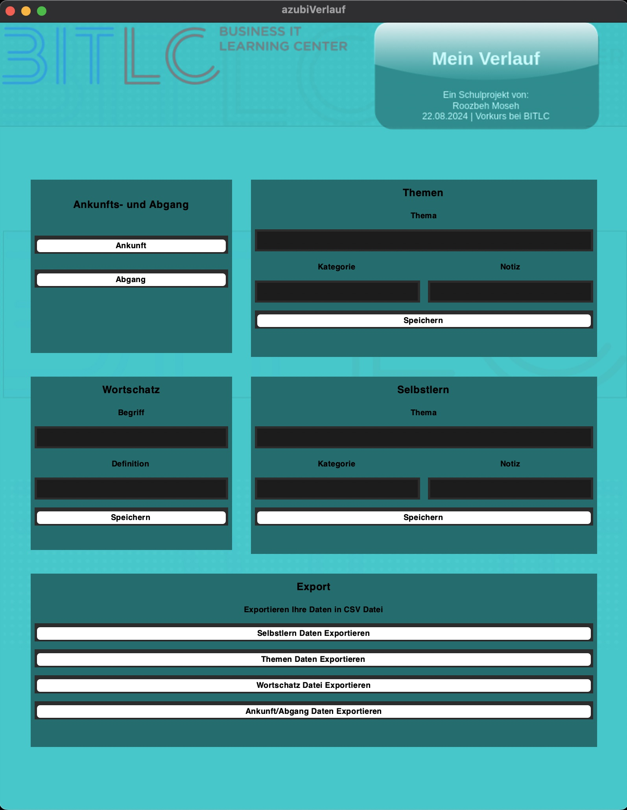

# Dokumentation für die azubiVerlauf-Anwendung

Diese Dokumentation bietet eine detaillierte Erklärung der `azubiVerlauf`-Anwendung, eines Python-basierten GUI-Programms, das Auszubildenden hilft, ihren Fortschritt zu verfolgen. Die Anwendung verwendet SQLite zur Datenspeicherung und Tkinter für die Benutzeroberfläche, mit Verbesserungen für eine bessere Leistung, insbesondere beim Umgang mit Hintergrundbildern.



## Inhaltsverzeichnis

1. [Überblick](#überblick)
2. [Importe und Datenbankeinrichtung](#importe-und-datenbankeinrichtung)
3. [Erstellung der Datenbanktabelle](#erstellung-der-datenbanktabelle)
   - [Datenbankverbindung](#datenbankverbindung)
   - [Tabellen erstellen](#tabellen-erstellen)
     - [eintragung-Tabelle](#eintragung-tabelle)
     - [themen-Tabelle](#themen-tabelle)
     - [selbstlearn-Tabelle](#selbstlearn-tabelle)
     - [wortschatz-Tabelle](#wortschatz-tabelle)
   - [Änderungen übernehmen und Verbindung schließen](#änderungen-übernehmen-und-verbindung-schließen)
4. [Benutzeroberflächen-Setup](#benutzeroberflächen-setup)
   - [Hauptfenster](#hauptfenster)
   - [Hintergrundbild](#hintergrundbild)
   - [Ankunfts-/Abreiseabschnitt](#ankunfts-abreiseabschnitt)
   - [Wortschatzabschnitt](#wortschatzabschnitt)
   - [Themenabschnitt](#themenabschnitt)
   - [Selbstlernabschnitt](#selbstlernabschnitt)
   - [Exportabschnitt](#exportabschnitt)
5. [Ereignisbehandlungsfunktionen](#ereignisbehandlungsfunktionen)
   - [Ankunftsfunktion](#ankunftsfunktion)
   - [Abgangsfunktion](#abgangsfunktion)
   - [Wortschatz speichern Funktion](#wortschatz-speichern-funktion)
   - [Themen speichern Funktion](#themen-speichern-funktion)
   - [Selbstlernen speichern Funktion](#selbstlernen-speichern-funktion)
   - [Export nach CSV Funktion](#export-nach-csv-funktion)
6. [Hauptfunktion](#hauptfunktion)
7. [Fazit](#fazit)

---
## Überblick

Die `azubiVerlauf`-Anwendung unterstützt Auszubildende bei:

- Der Erfassung von Ankunfts- und Abfahrtszeiten.
- Der Verwaltung von Vokabeln und Definitionen.
- Der Protokollierung von Themen und Selbstlernaktivitäten.
- Dem Export von Daten in CSV-Dateien.

Verbesserungen wurden vorgenommen, um die Leistung zu optimieren, insbesondere beim dynamischen Skalieren von Hintergrundbildern.

---

## Importe und Datenbankeinrichtung

```python
import sqlite3
import csv
import tkinter as tk
import datetime
from PIL import Image, ImageTk
```

- **sqlite3**: Stellt eine Verbindung zu SQLite-Datenbanken her und interagiert mit ihnen.
- **csv**: Liest und schreibt CSV-Dateien.
- **tkinter**: Erstellt grafische Benutzeroberflächen.
- **datetime**: Bearbeitet Daten- und Zeitoperationen.
- **PIL (Pillow)**: Bearbeitet Bilder, insbesondere für dynamisches Skalieren.

---

## Erstellung der Datenbanktabelle

### Datenbankverbindung

```python
sqliteDb = 'myVerlauf.db'   # Datenbank zuweisen
conn = sqlite3.connect(sqliteDb)  # Mit der Datenbank verbinden
cursor = conn.cursor()
```

- **sqliteDb**: Dateiname der Datenbank.
- **conn**: Stellt eine Verbindung zur SQLite-Datenbank her.
- **cursor**: Führt SQL-Befehle aus.

### Tabellen erstellen

#### eintragung-Tabelle

Erfasst Ankunfts- und Abfahrtszeiten.

```python
create_table_eintragung = """
CREATE TABLE IF NOT EXISTS eintragung (
    id INTEGER PRIMARY KEY AUTOINCREMENT, 
    datum DATETIME DEFAULT CURRENT_TIMESTAMP, 
    kategorie TEXT,
    dozent TEXT,
    notiz TEXT 
);
"""
cursor.execute(create_table_eintragung)
```

#### themen-Tabelle

Speichert Themen, Kategorien und Notizen.

```python
create_table_themen = """
CREATE TABLE IF NOT EXISTS themen (
    id INTEGER PRIMARY KEY AUTOINCREMENT, 
    datum DATETIME DEFAULT CURRENT_TIMESTAMP, 
    thema TEXT, 
    kategorie TEXT,
    notiz TEXT
);
"""
cursor.execute(create_table_themen)
```

#### selbstlearn-Tabelle

Protokolliert Selbstlernaktivitäten.

```python
create_table_selbstlearn = """
CREATE TABLE IF NOT EXISTS selbstlearn (
    id INTEGER PRIMARY KEY AUTOINCREMENT, 
    datum DATETIME DEFAULT CURRENT_TIMESTAMP, 
    thema TEXT, 
    kategorie TEXT,
    notiz TEXT
);
"""
cursor.execute(create_table_selbstlearn)
```

#### wortschatz-Tabelle

Verwaltet Vokabeln und Definitionen.

```python
create_table_wortschatz = """
CREATE TABLE IF NOT EXISTS wortschatz (
    id INTEGER PRIMARY KEY AUTOINCREMENT, 
    datum DATETIME DEFAULT CURRENT_TIMESTAMP, 
    title TEXT, 
    definition TEXT, 
    kategorie TEXT,
    notiz TEXT  
);
"""
cursor.execute(create_table_wortschatz)
```

### Änderungen übernehmen und Verbindung schließen

```python
conn.commit()
conn.close()
print(f"Datenbank wurde eingerichtet: '{sqliteDb}'")
```

- **Commit**: Speichert Änderungen in der Datenbank.
- **Close**: Schließt die Datenbankverbindung.

Stellen Sie die Verbindung für die kommenden Funktionen erneut her:

```python
conn = sqlite3.connect(sqliteDb)
cursor = conn.cursor()
```

---

## Benutzeroberflächen-Setup

### Hauptfenster

```python
def hauptFenster():
    haupt_fenster = tk.Tk()
    haupt_fenster.title("azubiVerlauf")
    haupt_fenster.maxsize(4000, 3000)
    haupt_fenster.minsize(800, 1000)
    return haupt_fenster
```

- **Erstellt**: Das Hauptanwendungsfenster.
- **Setzt**: Titel und Größenbeschränkungen.

### Hintergrundbild

```python
def hintergrundBild(haupt_fenster):
    hintergrund_bild_path = "resources/image/myVerlauf-Hauptfenster.png"
    hintergrund_bild = Image.open(hintergrund_bild_path)  # Bild mit Pillow laden

    def resize_background(event):
        # Vermeidet häufiges Skalieren durch Abbrechen vorheriger Skalierungsaufrufe
        if hasattr(resize_background, 'resize_id'):
            haupt_fenster.after_cancel(resize_background.resize_id)
        # Plant das Skalieren nach einer Verzögerung
        resize_background.resize_id = haupt_fenster.after(100, lambda: _resize(event))

    def _resize(event):
        new_width = event.width
        new_height = event.height
        hintergrund_bild_resized = hintergrund_bild.resize((new_width, new_height), Image.LANCZOS)
        hintergrund_photo = ImageTk.PhotoImage(hintergrund_bild_resized)
        # Aktualisiert das Label mit dem neuen Bild
        hintergrund_label.config(image=hintergrund_photo)
        hintergrund_label.image = hintergrund_photo  # Referenz behalten, um Garbage Collection zu verhindern

    # Erstellt ein Label für das Hintergrundbild
    hintergrund_label = tk.Label(haupt_fenster)
    hintergrund_label.place(x=0, y=0, relwidth=1, relheight=1)
    # Bindet das Resize-Ereignis, um das Hintergrundbild dynamisch zu skalieren
    haupt_fenster.bind("<Configure>", resize_background)
```

- **Verbesserung**: Verwendet Pillow, um das Hintergrundbild dynamisch zu skalieren, wenn sich die Fenstergröße ändert.
- **Vermeidet**: Übermäßiges Skalieren durch Einführung einer Verzögerung mit `after_cancel` und `after`.

### Ankunfts-/Abreiseabschnitt

```python
def an_ab_Abschnitt(haupt_fenster):
    an_ab_fenster = tk.Frame(haupt_fenster, bg="#007A7A")
    an_ab_fenster.place(relx=0.05, rely=0.2, relwidth=0.32, relheight=0.22)
    # Konfigurieren des Rasters
    an_ab_fenster.grid_columnconfigure(0, weight=1)
    an_ab_fenster.grid_columnconfigure(1, weight=1)
    # Widgets hinzufügen
    tk.Label(an_ab_fenster, text="Ankunfts- und Abgang", font=("Helvetica", 13, "bold"), fg="black", bg="#007A7A").grid(...)
    tk.Button(an_ab_fenster, text="Ankunft", font=("Helvetica", 10, "bold"), fg="black", bg="#009999", command=ankunft_function).grid(...)
    tk.Button(an_ab_fenster, text="Abgang", font=("Helvetica", 10, "bold"), fg="black", bg="#009999", command=abgang_func).grid(...)
```

- **Zweck**: Ermöglicht Benutzern, Ankunfts- und Abfahrtszeiten zu protokollieren.
- **Komponenten**:
  - **Labels**: Für den Abschnittstitel.
  - **Buttons**: "Ankunft" und "Abgang".
- **Visuelle Aktualisierung**: Textfarbe wurde auf Schwarz geändert, um den Kontrast zu verbessern.

### Wortschatzabschnitt

```python
def wortschatz_abschnitt(haupt_fenster):
    global entry_wort_title, entry_definition
    wortschatz_fenster = tk.Frame(haupt_fenster, bg="#007A7A")
    wortschatz_fenster.place(relx=0.05, rely=0.45, relwidth=0.32, relheight=0.22)
    # Konfigurieren des Rasters
    wortschatz_fenster.grid_columnconfigure(0, weight=1)
    wortschatz_fenster.grid_columnconfigure(1, weight=1)
    # Widgets hinzufügen
    tk.Label(wortschatz_fenster, text="Wortschatz", font=("Helvetica", 13, "bold"), fg="black", bg="#007A7A").grid(...)
    tk.Label(wortschatz_fenster, text="Begriff", font=("Helvetica", 10, "bold"), fg="black", bg="#007A7A").grid(...)
    entry_wort_title = tk.Entry(wortschatz_fenster)
    entry_wort_title.grid(...)
    tk.Label(wortschatz_fenster, text="Definition", font=("Helvetica", 10, "bold"), fg="black", bg="#007A7A").grid(...)
    entry_definition = tk.Entry(wortschatz_fenster)
    entry_definition.grid(...)
    tk.Button(wortschatz_fenster, text="Speichern", font=("Helvetica", 10, "bold"), fg="black", bg="#009999", command=wortschatz_speichern).grid(...)
```

- **Zweck**: Ermöglicht Benutzern, Vokabeln und Definitionen hinzuzufügen.
- **Komponenten**:
  - **Eingabefelder**: Für Begriff und Definition.
  - **Button**: "Speichern", um den Eintrag zu speichern.
- **Visuelle Aktualisierung**: Textfarbe wurde auf Schwarz geändert.

### Themenabschnitt

```python
def themen_abschnitt(haupt_fenster):
    themen_fenster = tk.Frame(haupt_fenster, bg="#007A7A")
    themen_fenster.place(relx=0.4, rely=0.2, relwidth=0.55, relheight=0.225)
    # Konfigurieren des Rasters
    themen_fenster.grid_columnconfigure(0, weight=1)
    themen_fenster.grid_columnconfigure(1, weight=1)
    # Widgets hinzufügen
    tk.Label(themen_fenster, text="Themen", font=("Helvetica", 13, "bold"), fg="black", bg="#007A7A").grid(...)
    tk.Label(themen_fenster, text="Thema", font=("Helvetica", 10, "bold"), fg="black", bg="#007A7A").grid(...)
    entry_thema = tk.Entry(themen_fenster)
    entry_thema.grid(...)
    tk.Label(themen_fenster, text="Kategorie", font=("Helvetica", 10, "bold"), fg="black", bg="#007A7A").grid(...)
    entry_kategorie = tk.Entry(themen_fenster)
    entry_kategorie.grid(...)
    tk.Label(themen_fenster, text="Notiz", font=("Helvetica", 10, "bold"), fg="black", bg="#007A7A").grid(...)
    entry_notiz = tk.Entry(themen_fenster)
    entry_notiz.grid(...)
    tk.Button(themen_fenster, text="Speichern", font=("Helvetica", 10, "bold"), fg="black", bg="#009999", command=lambda: themen_speichern_funktion(entry_thema, entry_kategorie, entry_notiz)).grid(...)
```

- **Zweck**: Ermöglicht Benutzern, Themen mit Kategorien und Notizen zu protokollieren.
- **Komponenten**:
  - **Eingabefelder**: Für Thema, Kategorie und Notiz.
  - **Button**: "Speichern", um das Thema zu speichern.
- **Visuelle Aktualisierung**: Textfarbe wurde auf Schwarz geändert.

### Selbstlernabschnitt

```python
def selbstlern_abschnitt(haupt_fenster):
    selbstlern_fenster = tk.Frame(haupt_fenster, bg="#007A7A")
    selbstlern_fenster.place(relx=0.4, rely=0.45, relwidth=0.55, relheight=0.225)
    # Konfigurieren des Rasters
    selbstlern_fenster.grid_columnconfigure(0, weight=1)
    selbstlern_fenster.grid_columnconfigure(1, weight=1)
    # Widgets hinzufügen
    tk.Label(selbstlern_fenster, text="Selbstlern", font=("Helvetica", 13, "bold"), fg="black", bg="#007A7A").grid(...)
    tk.Label(selbstlern_fenster, text="Thema", font=("Helvetica", 10, "bold"), fg="black", bg="#007A7A").grid(...)
    entry_thema = tk.Entry(selbstlern_fenster)
    entry_thema.grid(...)
    tk.Label(selbstlern_fenster, text="Kategorie", font=("Helvetica", 10, "bold"), fg="black", bg="#007A7A").grid(...)
    entry_kategorie = tk.Entry(selbstlern_fenster)
    entry_kategorie.grid(...)
    tk.Label(selbstlern_fenster, text="Notiz", font=("Helvetica", 10, "bold"), fg="black", bg="#007A7A").grid(...)
    entry_notiz = tk.Entry(selbstlern_fenster)
    entry_notiz.grid(...)
    tk.Button(selbstlern_fenster, text="Speichern", font=("Helvetica", 10, "bold"), fg="black", bg="#009999", command=lambda: selbstlern_speichern_funktion(entry_thema, entry_kategorie, entry_notiz)).grid(...)
```

- **Zweck**: Protokolliert Selbstlernthemen.
- **Komponenten**:
  - Ähnlich wie im Themenabschnitt.
  - **Eingabefelder**: Für Selbstlernthema, Kategorie und Notiz.
  - **Button**: "Speichern", um den Eintrag zu speichern.
- **Visuelle Aktualisierung**: Textfarbe wurde auf Schwarz geändert.

### Exportabschnitt

```python
def export_abschnitt(haupt_fenster):
    export_fenster = tk.Frame(haupt_fenster, bg="#007A7A")
    export_fenster.place(relx=0.05, rely=0.7, relwidth=0.9, relheight=0.22)
    # Konfigurieren des Rasters
    export_fenster.grid_columnconfigure(0, weight=1)
    export_fenster.grid_columnconfigure(1, weight=1)
    # Widgets hinzufügen
    tk.Label(export_fenster, text="Export", font=("Helvetica", 13, "bold"), fg="black", bg="#007A7A").grid(...)
    tk.Label(export_fenster, text="Exportieren Sie Ihre Daten in CSV-Datei", font=("Helvetica", 10, "bold"), fg="black", bg="#007A7A").grid(...)
    tk.Button(export_fenster, text="Selbstlern Daten exportieren", font=("Helvetica", 10, "bold"), fg="black", bg="#009999", command=lambda: sqliteDb_to_csv(Selbstlern)).grid(...)
    tk.Button(export_fenster, text="Themen Daten exportieren", font=("Helvetica", 10, "bold"), fg="black", bg="#009999", command=lambda: sqliteDb_to_csv(themen)).grid(...)
    tk.Button(export_fenster, text="Wortschatz Datei exportieren", font=("Helvetica", 10, "bold"), fg="black", bg="#009999", command=lambda: sqliteDb_to_csv(wortschatz)).grid(...)
    tk.Button(export_fenster, text="Ankunft/Abgang Daten exportieren", font=("Helvetica", 10, "bold"), fg="black", bg="#009999", command=lambda: sqliteDb_to_csv(eintragung)).grid(...)
```

- **Zweck**: Bietet Optionen zum Exportieren von Daten in CSV-Dateien.
- **Komponenten**:
  - **Buttons**: Für den Export jeder Datenkategorie.
- **Visuelle Aktualisierung**: Textfarbe wurde auf Schwarz geändert.

---

## Ereignisbehandlungsfunktionen

### Ankunftsfunktion

```python
def ankunft_function():
    current_datetime = datetime.datetime.now().strftime("%Y-%m-%d %H:%M:%S")
    values = {
        'datum': current_datetime,
        'kategorie': 'eingang'
    }
    columns = ', '.join(values.keys())
    placeholders = ', '.join('?' for _ in values)
    query = f"INSERT INTO eintragung ({columns}) VALUES ({placeholders})"
    cursor.execute(query, tuple(values.values()))
    conn.commit()
    print("Daten in 'eintragung' eingefügt:", values)
```

- **Protokolliert**: Das aktuelle Datum und die Uhrzeit als Ankunftseintrag.
- **Fügt ein**: In die Tabelle `eintragung` mit der Kategorie 'eingang'.

### Abgangsfunktion

```python
def abgang_func():
    current_datetime = datetime.datetime.now().strftime("%Y-%m-%d %H:%M:%S")
    values = {
        'datum': current_datetime,
        'kategorie': 'ausgang'
    }
    columns = ', '.join(values.keys())
    placeholders = ', '.join('?' for _ in values)
    query = f"INSERT INTO eintragung ({columns}) VALUES ({placeholders})"
    cursor.execute(query, tuple(values.values()))
    conn.commit()
    print("Daten in 'eintragung' eingefügt:", values)
```

- **Protokolliert**: Das aktuelle Datum und die Uhrzeit als Abgangseintrag.
- **Fügt ein**: In die Tabelle `eintragung` mit der Kategorie 'ausgang'.

### Wortschatz speichern Funktion

```python
def wortschatz_speichern():
    wort_title = entry_wort_title.get()
    definition = entry_definition.get()
    wortschatz_speichern_funktion(wort_title, definition)
```

- **Holt**: Eingaben aus den Vokabeleingabefeldern.
- **Ruft auf**: Die Funktion zum Speichern der Daten in der Datenbank.

```python
def wortschatz_speichern_funktion(wort_title, definition):
    with sqlite3.connect(sqliteDb) as conn:
        cursor = conn.cursor()
        cursor.execute("INSERT INTO wortschatz (title, definition) VALUES (?, ?)", (wort_title, definition))
        conn.commit()
```

- **Fügt ein**: Den Begriff und die Definition in die Tabelle `wortschatz`.

### Themen speichern Funktion

```python
def themen_speichern_funktion(entry_thema, entry_kategorie, entry_notiz):
    thema = entry_thema.get()
    kategorie = entry_kategorie.get()
    notiz = entry_notiz.get()
    with sqlite3.connect(sqliteDb) as conn:
        cursor = conn.cursor()
        cursor.execute("INSERT INTO themen (thema, kategorie, notiz) VALUES (?, ?, ?)", (thema, kategorie, notiz))
        conn.commit()
```

- **Holt**: Eingaben aus dem Themenabschnitt.
- **Fügt ein**: Daten in die Tabelle `themen`.

### Selbstlernen speichern Funktion

```python
def selbstlern_speichern_funktion(entry_thema, entry_kategorie, entry_notiz):
    thema = entry_thema.get()
    kategorie = entry_kategorie.get()
    notiz = entry_notiz.get()
    with sqlite3.connect(sqliteDb) as conn:
        cursor = conn.cursor()
        cursor.execute("INSERT INTO selbstlearn (thema, kategorie, notiz) VALUES (?, ?, ?)", (thema, kategorie, notiz))
        conn.commit()
```

- **Holt**: Eingaben aus dem Selbstlernabschnitt.
- **Fügt ein**: Daten in die Tabelle `selbstlearn`.

### Export nach CSV Funktion

```python
def sqliteDb_to_csv(table):
    cursor.execute(f"SELECT * FROM {table}")
    rows = cursor.fetchall()
    with open(f"{table}.csv", 'w', newline='') as file:
        writer = csv.writer(file)
        writer.writerow([i[0] for i in cursor.description])  # Headerzeile
        writer.writerows(rows)
```

- **Exportiert**: Daten aus der angegebenen Tabelle in eine CSV-Datei.
- **Parameter**:
  - **table**: Name der zu exportierenden Tabelle.

Tabellennamen definieren:

```python
Selbstlern = 'selbstlearn'
wortschatz = 'wortschatz'
themen = 'themen'
eintragung = 'eintragung'
```

---

## Hauptfunktion

```python
def main():
    fenster = hauptFenster()
    hintergrundBild(fenster)
    an_ab_Abschnitt(fenster)
    wortschatz_abschnitt(fenster)
    themen_abschnitt(fenster)
    selbstlern_abschnitt(fenster)
    export_abschnitt(fenster)
    fenster.mainloop()
```

- **Initialisiert**: Das Hauptfenster und fügt alle UI-Abschnitte hinzu.
- **Startet**: Die Tkinter-Ereignisschleife mit `mainloop()`.

```python
if __name__ == "__main
```

- **Stellt sicher**: Die `main()`-Funktion wird ausgeführt, wenn das Skript direkt ausgeführt wird.

---

## Fazit

Die `azubiVerlauf`-Anwendung ist ein umfassendes Tool für Auszubildende, um:

- Ankunfts- und Abfahrtszeiten zu protokollieren.
- Vokabeln und Definitionen zu verwalten.
- Themen und Selbstlernaktivitäten aufzuzeichnen.
- Ihre Daten für Berichterstattung und Analyse zu exportieren.

