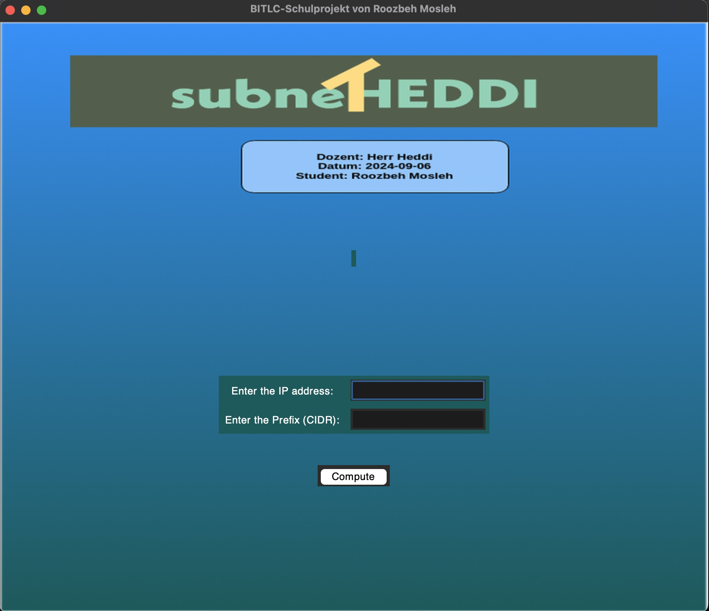

# subnetHeddi: IP-Adresse und Subnetzrechner

## Überblick

Dieses Python-Programm wurde während meines Vorbereitungskurses am BITLC Dortmund geschrieben. Während eines Netzwerkmoduls entwickelte ich dieses Projekt, um ein praktisches Verständnis für Netzwerk Konzepte zu gewinnen. Dieses Tool, das mit der Tkinter-GUI-Bibliothek erstellt wurde, hilft, wichtige Netzwerkinformationen wie die Subnetzmaske, die Netzwerkadresse, die Broadcast-Adresse, den Hostbereich und die Anzahl der verfügbaren IP-Adressen zu berechnen. Der Benutzer gibt eine IP-Adresse und ein CIDR-Präfix ein, und das Programm zeigt die Ergebnisse sowohl im Binär- als auch im Dezimalformat an.



## Funktionen

- **IP-Adresseneingabe:** Geben Sie die IP-Adresse im Standard-IPv4-Format ein (z. B. `192.168.1.1`).

- **CIDR-Eingabe:** Geben Sie die Subnetzmaske in CIDR-Notation ein (z. B. `24` für ein `/24`-Subnetz).

- **Berechnungen:**

  - Binäre und Dezimale Subnetzmaske

  - Netzwerkadresse (binär und dezimal)

  - Broadcast-Adresse (binär und dezimal)

  - Host-Min und -Max

  - Verfügbare IP-Adressen

- **Ergebnisse in der Mitte des Fensters angezeigt:** Ergebnisse werden über dem Hintergrundbild zentriert über den Eingabefeldern angezeigt.


## Anforderungen

- Python 3.x

- Tkinter (wird mit den meisten Python-Distributionen mitgeliefert)

- PIL (Pillow-Bibliothek für die Bildbearbeitung)

Um Pillow zu installieren, verwenden Sie den folgenden Befehl:

```bash
pip install pillow
```


## Verwendung

1. Führen Sie das Python-Programm aus.

2. Geben Sie eine IP-Adresse in das Eingabefeld für "IP-Adresse eingeben" ein.

3. Geben Sie das CIDR-Präfix in das Eingabefeld für "Präfix (CIDR) eingeben" ein.

4. Klicken Sie auf die Schaltfläche "Berechnen".

5. Das Ergebnis wird in der Mitte des Fensters angezeigt.


## Beispiel

- **Eingabe:**

IP-Adresse: `192.168.1.1`

CIDR-Präfix: `24`

- **Ausgabe:**

```
IP-Adresse: 192.168.1.1

IP-Adresse (Binär): 11000000.10101000.00000001.00000001

Subnetzmaske: 255.255.255.0

Subnetzmaske (Binär): 11111111.11111111.11111111.00000000

Netzwerkadresse: 192.168.1.0

Netzwerkadresse (Binär): 11000000.10101000.00000001.00000000

Broadcast-Adresse: 192.168.1.255

Broadcast-Adresse (Binär): 11000000.10101000.00000001.11111111

Host Min: 192.168.1.1

Host Max: 192.168.1.254

Verfügbare IPs: 254
```


## Quellcode


```python
import tkinter as tk

from tkinter import Label, Frame, simpledialog

from PIL import Image, ImageTk

import os

  

# Haupt-Fenster erstellen

haupt_fenster = tk.Tk()

haupt_fenster.title("BITLC-Schulprojekt von Roozbeh Mosleh")

haupt_fenster.maxsize(3000, 2500) # Breite x Höhe

haupt_fenster.minsize(900, 750) # Breite x Höhe

haupt_fenster.config(bg="#006666")

  

# Bannerbild laden und anzeigen

banner_path = os.path.join(os.path.dirname(os.path.abspath(__file__)), 'bg.png')

banner_img = Image.open(banner_path)

# Bild bei Bedarf skalieren

banner_resized = banner_img.resize((900, 750), Image.LANCZOS)

banner_photo = ImageTk.PhotoImage(banner_resized)

  

banner_label = Label(haupt_fenster, image=banner_photo, bg="white", relief=tk.SUNKEN)

banner_label.image = banner_photo # Hält eine Referenz

banner_label.pack()

  

# Erstellt das Label zur Anzeige des Ergebnisses und platziert es in der Mitte des Fensters, über den Eingabefeldern

result_label = tk.Label(haupt_fenster, text="", font=("Helvetica", 13, "bold"), fg="white", bg="#006666", justify="left")

result_label.place(relx=0.5, rely=0.4, anchor='center')

  

# Erstellt einen Rahmen für die Eingaben
input_frame = tk.Frame(haupt_fenster, bg="#006666")
input_frame.place(relx=0.5, rely=0.6, anchor='n') # Platziert unter dem result_label

  

# IP-Adresslabel und Eingabe

ip_label = tk.Label(input_frame, text="Enter the IP address:", font=("Helvetica", 13), fg="white", bg="#006666")

ip_label.grid(row=0, column=0, padx=5, pady=5)

ip_entry = tk.Entry(input_frame, font=("Helvetica", 13))

ip_entry.grid(row=0, column=1, padx=5, pady=5)

  

# Prefix label and entry

prefix_label = tk.Label(input_frame, text="Enter the Prefix (CIDR):", font=("Helvetica", 13), fg="white", bg="#006666")

prefix_label.grid(row=1, column=0, padx=5, pady=5)

prefix_entry = tk.Entry(input_frame, font=("Helvetica", 13))

prefix_entry.grid(row=1, column=1, padx=5, pady=5)

  

# Berechnen-Schaltfläche

compute_button = tk.Button(haupt_fenster, text="Compute", font=("Helvetica", 13), command=lambda: compute_results())

compute_button.place(relx=0.5, rely=0.75, anchor='n')

  

def compute_results():

ip_address = ip_entry.get()

cidr_prefix = prefix_entry.get()

try:

sliced_ip_list = ip_address.split(".")

if len(sliced_ip_list) != 4:

raise ValueError("Invalid IP address format")

ip_octets_int = []

bin_ip_list = []

for element in sliced_ip_list:

int_element = int(element)

if not 0 <= int_element <= 255:

raise ValueError("IP address octets must be between 0 and 255")

ip_octets_int.append(int_element)

bin_ip_list.append(format(int_element, '08b'))

cidr_prefix = int(cidr_prefix)

if not 0 <= cidr_prefix <= 32:

raise ValueError("CIDR prefix must be between 0 and 32")

eins = cidr_prefix * '1'

nulls_count = 32 - cidr_prefix

nulls = nulls_count * '0'

subnet_eins_nulls = eins + nulls

# Teilt das binäre Subnetz in 4 Teile

s1 = subnet_eins_nulls[:8]

s2 = subnet_eins_nulls[8:16]

s3 = subnet_eins_nulls[16:24]

s4 = subnet_eins_nulls[24:32]

bin_subnet_list = [s1, s2, s3, s4]

dec_subnet_list = [int(element, 2) for element in bin_subnet_list]

# Netzwerkadresse

dec_network_address_ls = [ip & subnet for ip, subnet in zip(ip_octets_int, dec_subnet_list)]

bin_network_address_ls = [format(addr, '08b') for addr in dec_network_address_ls]

# Broadcast-Adresse

dec_wildcard_mask_list = [255 - subnet for subnet in dec_subnet_list]

dec_broadcast_address_ls = [network | wildcard for network, wildcard in zip(dec_network_address_ls, dec_wildcard_mask_list)]

bin_broadcast_address_ls = [format(addr, '08b') for addr in dec_broadcast_address_ls]

# Host Min und Max

host_min = dec_network_address_ls[:]

host_min[-1] += 1

host_max = dec_broadcast_address_ls[:]

host_max[-1] -= 1

# Anzahl der verfügbaren IPs

available_ips = (2 ** (32 - cidr_prefix)) - 2 # Schließt Netzwerk- und Broadcast-Adressen aus

# Bereite Daten zur Anzeige vor

display_result_show = display_result(sliced_ip_list, bin_ip_list, dec_subnet_list, bin_subnet_list,

dec_network_address_ls, bin_network_address_ls,

dec_broadcast_address_ls, bin_broadcast_address_ls,

available_ips, host_min, host_max)

# Aktualisiere result_label

result_label.config(text=display_result_show)

except ValueError as e:

result_label.config(text=str(e))

  

def display_result(sliced_ip_list, bin_ip_list, dec_subnet_list, bin_subnet_list,

dec_network_address_ls, bin_network_address_ls,

dec_broadcast_address_ls, bin_broadcast_address_ls,

available_ips, host_min, host_max):

result_text = f"IP Address: {'.'.join(sliced_ip_list)}\n" \

f"IP Address (Binary): {'.'.join(bin_ip_list)}\n" \

f"Subnet Mask: {'.'.join(map(str, dec_subnet_list))}\n" \

f"Subnet Mask (Binary): {'.'.join(bin_subnet_list)}\n" \

f"Network Address: {'.'.join(map(str, dec_network_address_ls))}\n" \

f"Network Address (Binary): {'.'.join(bin_network_address_ls)}\n" \

f"Broadcast Address: {'.'.join(map(str, dec_broadcast_address_ls))}\n" \

f"Broadcast Address (Binary): {'.'.join(bin_broadcast_address_ls)}\n" \

f"Host Min: {'.'.join(map(str, host_min))}\n" \

f"Host Max: {'.'.join(map(str, host_max))}\n" \

f"Available IPs: {available_ips}"

return result_text

  

haupt_fenster.mainloop()
```
